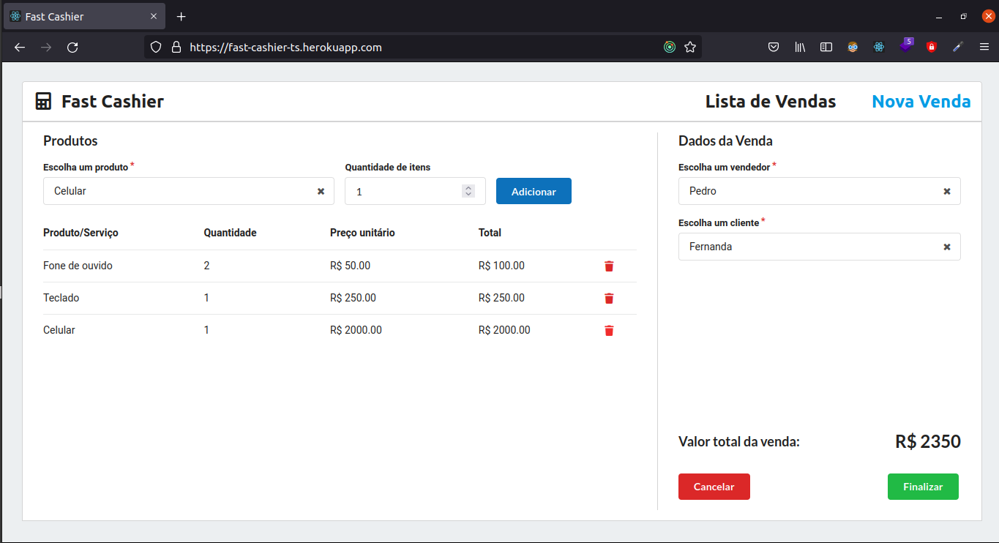

<h1 align="center">
  
</h1>

<h2 align="center">
  Fast Cashier - JV
</h2>

## :computer: Sobre

Frontend para projeto de um caixa rápido de uma empresa hipotética que consome API desse [repositório](https://github.com/jvictor-am/fast-cashier-django). <br/>
[Clique aqui](https://fast-cashier-ts.herokuapp.com) para ver acessar. Deploy realizado com o heroku.


## Funcionalidades

- [Listar](https://fast-cashier-ts.herokuapp.com/vendas) pedidos/vendas
- [Adicionar e excluir](https://fast-cashier-ts.herokuapp.com/) produtos durante uma venda
- Valor total da venda
- Selecionar cliente
- Selecionar vendendor
- Finalizar ou Cancelar a venda 


## Feito com

- React
- Yarn
- Typescript
- ES6
- Styled Components
- Semantic-ui-react
- React-Redux
- Redux-Saga
- React-router-dom
- React-toastify
- etc...


## Instruçoẽs para instalação em ambiente local:

  - Clonar projeto:
    ```
    $ git clone git@github.com:jvictor-am/fast-cashier-react.git
    ```
  - Ir para pasta do projeto:
    ```
    $ cd fast-cashier-react
    ```
  - Instalar pacotes listados no arquivo package.json:
    ```
    $ yarn install
    ```
  - Executar em localhost
    ```
    $ yarn start
    ```
  - A partir daqui você deve ser capaz de visualizar a aplicaçao browser:
    ```
    $ http://localhost:3000
    ```

---

# Author

[**João Victor**](https://www.linkedin.com/in/jo%C3%A3o-victor-de-andrade-mesquita-848a09122/)

<h2 align="center">
  Thank You!
</h2>
